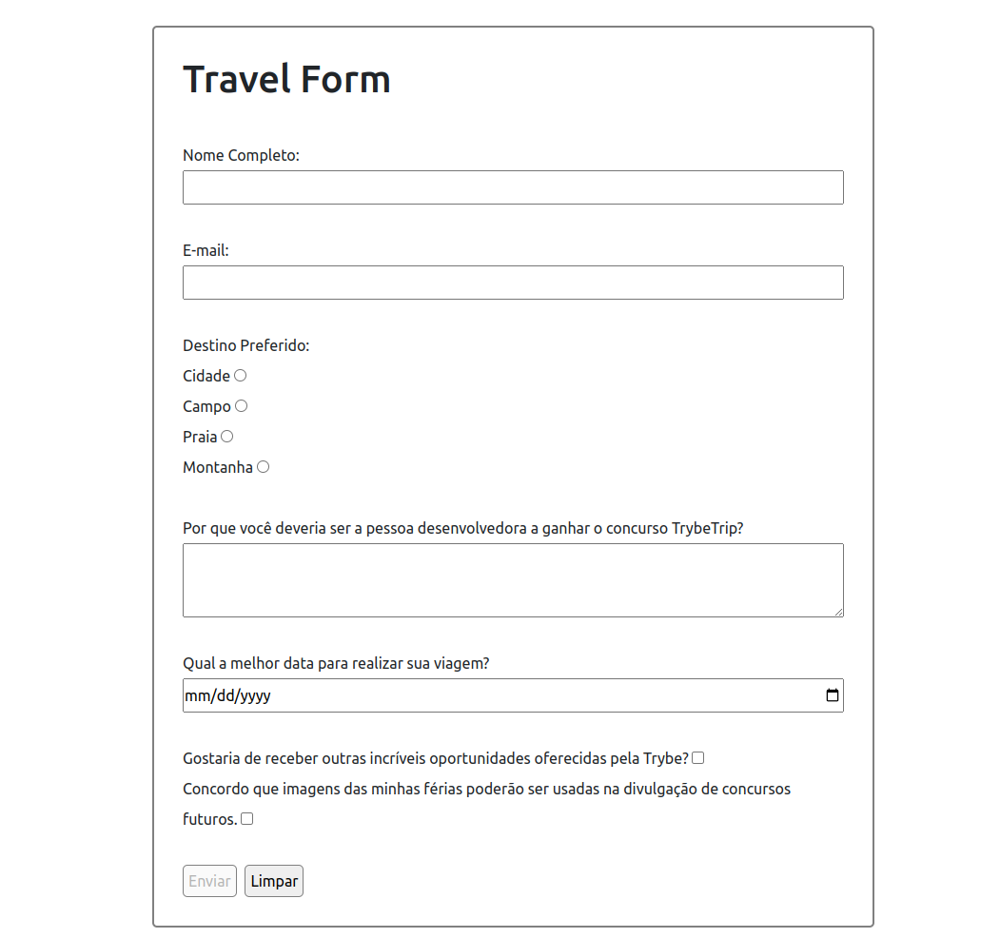

# README: Travel Form



[Page link]( https://feduarte-dev.github.io/travel-form/)

## Project Description

This project was designed to develop a form trip in which the user fills in the inputs, and JavaScript validates them to enable the submit button.

### Technologies

- LINUX
- VSCODE
- JAVASCRIPT
- HTML
- CSS

### What I Learned

- A lot HTML form tags
- How to use event listener in buttons and inputs

## How to Run the Project

1. Clone the repository:

   ```bash
   git clone https://github.com/feduarte-dev/travel-form
   ```

2. Navigate to the project directory:

   ```bash
   cd your-repository
   ```

3. Install dependencies:

   ```bash
   npm install
   ```

4. Right click form.html and open it with live server

## Contributions

[Felipe](https://www.linkedin.com/in/feduarte-dev/) - form.html - script.css - style-css


[Trybe](https://www.betrybe.com/) - Everything else
